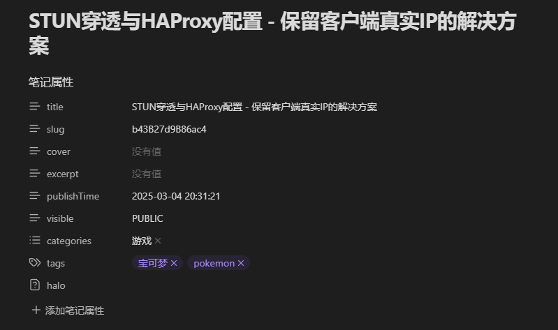

插件源自：[halo-sigs/obsidian-halo: Publish your Obsidian documents to Halo.](https://github.com/halo-sigs/obsidian-halo)

## 背景说明

我的工作流有点不一样，我更加希望把博客的笔记全部统一管理至一个文件夹，这样即使远端的数据丢失，乃至需要从halo迁移至其他博客，本地一份备份总是安全的。

## 功能修改

- 指定博客文件夹路径，右键复制到博客文件夹时会在原文件上面生成双向链接，便于更新两边的内容
- 笔记属性新增封面、摘要、发布时间、可视性等选项
- slug部分修改成根据**SHA256截断法 + 随机盐**生成随机数，原本的拼音slug实在是不太友好。

由于修改比较匆忙，直接在原编译后的js程序基础上，修改了自己需要的部分，没有从ts编译。关于ai自动生成摘要和标签建议配合Auto-title-tag使用

